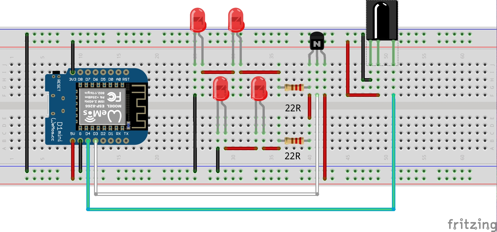

IR Blaster for ESP8266
======================

This is simple infrared sender/receiver controlled over MQTT.
It uses the [Homie MQTT convention](https://github.com/marvinroger/homie)
and is based on [Homie implementation for ESP8266](https://github.com/marvinroger/homie-esp8266) by
Marvin Roger.


Wiring diagram
--------------

The wirring bellow is the one I used and worked for me. 
You will likely need to [adjust](http://led.linear1.org/led.wiz) the 
resistor sizes based on the voltage drop and max current for your IR diodes.
The transistor is general purpose NPN transistor (I used BSY34)




Instalation
-----------

To compile this arduino sketch you need to instal following libraries to your Arduino IDE:

- [Homie for ESP8266](https://github.com/marvinroger/homie-esp8266) and all it's [dependencies](https://homie-esp8266.readme.io/docs/getting-started#section-installing-homie-for-esp8266)
- [IRremoteESP8266](https://github.com/sebastienwarin/IRremoteESP8266)
- [ArduinoJson](https://github.com/bblanchon/ArduinoJson)

as well I recommend to install the [Homie UI Bundle](https://homie-esp8266.readme.io/docs/ui-bundle) 
to [data/homie](https://github.com/marvinroger/homie-esp8266/tree/develop/data/homie) folder, 
install [arduino-sep8266fs-plugin](https://github.com/esp8266/arduino-esp8266fs-plugin)
and upload the UI to SPIFS.

Once you upload the sketch, you have to configure the node as described in [Homie Getting Started Tutorial](https://homie-esp8266.readme.io/docs/getting-started)

Interface
---------

- To listen for received IR codes, subscribe to MQTT topic `homie/<sensorid>/infrared/code`:

```bash
$ mosquitto_sub -h 192.168.1.50 -v -t 'homie/5ccf7fd38d01/infrared/code'
homie/5ccf7fd38d01/infrared/code {"name":"UNKNOWN: 0x42D74094","value":1121403028,"frequency":38,"type":{"id":-1,"name":"UNKNOWN"},"raw":[9100,4600,600,650,600,1750,600,1750,600,1750,600,650,600,1750,600,1750,600,1750,600,1750,600,1750,600,1750,600,650,600,650,600,650,600,650,600,1800,600,650,600,650,600,1750,600,650,600,650,600,650,600,650,600,650,600,1750,600,1750,600,650,600,650,600,1750,600,1750,600,650,600,650,600]}
```

- To send IR codes, publish to MQTT topic `homie/<sensorid>/infrared/code/set`:
```bash
mosquitto_pub -h 192.168.1.50 -t 'homie/5ccf7fd38d01/infrared/code/set' -m "{"frequency":38,"raw":[900,900,1800,900,900,900,900,900,900,900,900,900,900,900,900,900,900,900,900,900,900,900,900,1800,900]}";
```


